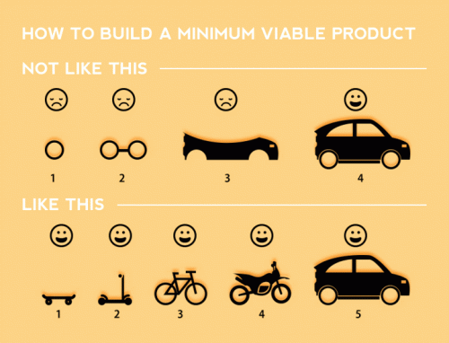

<section id="table-of-contents" class="toc">
  <header>
    <h3>Overview</h3>
  </header>

*  Auto generated table of contents
{:toc}

</section><!-- /#table-of-contents -->

There are many terms that are thrown around willy nilly, and MVP, or Minimum Viable Product is another one of them.  Widely miss-applied, and used interchangeably with prototype, beta, alpha, etc, what actually is an MVP?  If a picture speaks a thousand words, I believe this one from <a href="http://blog.fastmonkeys.com/" target="_blank">fast monkeys</a> and inspired by the great Spotify team sums it up really well.

<figure>
	
	<figcaption>This image: too good not to share as much as possible</figcaption>
</figure>

## Minimum loVable Product

I saw Spotify put another spin on the term MVP which I really like, they called it a Minimum loVeable Product.

The image talks about building a car.  The goal of the car is to get you from A to B.  So instead of first building a wheel that is of no use to anyone, a first MVP would be a Skateboard - it gets you from A to B a bit better than walking.  You get the idea.

An MVP delivers actual value to the business earlier, and provides more opportunity for the user to see it, try it, and give valuable feedback to help steer the product in the right direction as it grows.

## MVP Example

It is always tempting to break the MVP delivery and go above and beyond.  On a project our team was once asked to build a user login system.  We discovered the reason was because they wanted to restrict a section of their site to only a few staff members.

We thought about building a database driven user management system, complete with user administration and access profiles.  But then we stopped and thought about the MVP approach.  We ended up building a login page, with a username and password hard coded into the server.  It feels dirty and its not an ideal solution, however it got the business closer to what they wanted in a matter of hours rather than weeks.

We delivered something that helped them toward their goal very quickly.  We could then improve on that solution, one small step at a time, until the business was happy that they had everything they wanted.

## Case Study: Zappos

A great example of an MVP is the birth of Zappos.  The founder, Nick Swinmurn could not find a pair of shoes at the mall, then discovered that there were no major online shoe stores.  But is there are market for people to buy shoe's online?

His MVP was simple; he went to a shoe store and took some pictures of shoes to put on a quick and dirty website.  If anyone bought the shoes, he returned to the store, bought them and shipped them.

His MVP lead to being one of the worlds largest online shoe stores, selling for around $1.2 billion just 10 years after launch.

## Summary

Hopefully this post helps to give a slightly better understanding of building an MVP.  We will often tend to think of the big picture right away and go head first into the most complex all encompassing solution.  We need to keep questioning ourselves; can we instead deliver the Minimum loVeable Product that will help get the business even just a small step closer to their goal?