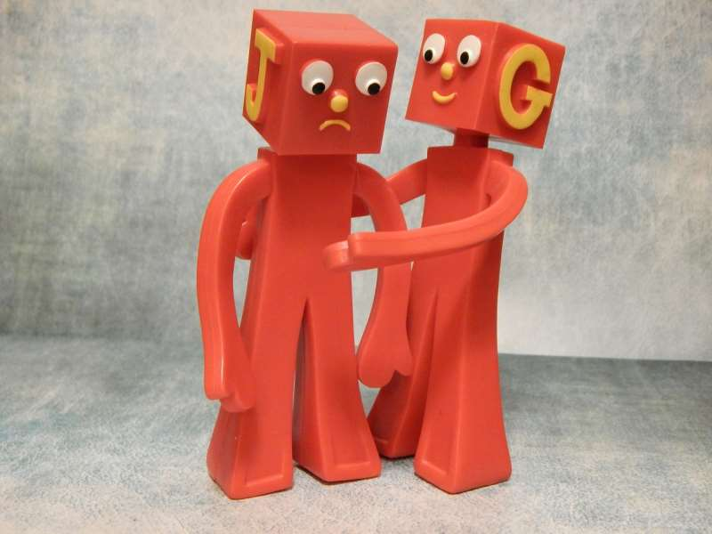

<section id="table-of-contents" class="toc">
  <header>
    <h3>Overview</h3>
  </header>

*  Auto generated table of contents
{:toc}

</section><!-- /#table-of-contents -->

In the <a href="../product-owner">Ever met a good product owner</a> post, we ran through some of the responsibilities of what will help to make a "good" product owner.

In this post I cover three common problems that Bob the product owner may have with the role.

<figure>

<figcaption>Let's turn that product owner frown upside down</figcaption>
</figure>

## The unempowered product owner

As the product owner, Bob holds a lot of responsibility.  And as Spidermans uncle said, with great responsibility comes great power.  Well actually he said it the other way around, but that doesn't work as well right now.

I have personally seen that having a product owner that is not empowered leads to a lot of problems.  Miscommunication, the product heading in the wrong direction, delays in decisions, confusion in who actually owns the product, an unstable backlog, a direction-less team.

### Symptoms

Bob may really just be a glorified backlog assistant; there is another role like a product manager who is in charge of the product vision, the market direction, collaborating with clients, etc, while the product owner has been left just to do stuff for the scrum team.

The business may not trust Bob to make the right decisions, so managers and other higher ups are constantly meddling and overruling his decisions.  Bob probably has to jump through management hoops any time he wants to make a decision.

### Fix it!

It is important to educate the business on the role of the product owner.  One of the key benefits of agile development is being able to close the gap between the team and the customers.  A product owner should be fully empowered to be able to play that role, and not have other managers interfering with this process.

For a product owner to be effective, they have to also be the ones who own the vision of the product.  The person who collaborates with the customers and stakeholders, who builds a vision from this interaction, and who keeps tabs on the intended market, will be the best person to make the final decision on what should go into the backlog.  The product owner needs to be trusted to fill this role.

## The Product Owner is hardly available

It's the daily stand up, but Bobs not there.  Instead he comes around an hour later and asks everyone for another update.

The team pick up a new story and want to have a discussion with Bob, but Bobs not there.  They make their best guess and start implementing the story incorrectly, not realising that there has been a last minute update on that story.

A developer has a major realisation half way through a story, and needs to speak to Bob before he can continue, but Bobs not there.  Instead that story moves into blocked, and another story is started.  We now have two half done stories in progress.

A story has been finished, and it has to be demoed to Bob before it can be released, but Bobs not there.  The release gets delayed.

### Symptoms

Usually, it is because the product owner is too busy doing his real job.  That's right, the development team is a very expensive resource, the software product maybe critical to the company, and the product owner is responsible for the success of their output, however the company has decided that they won't get a full time product owner.  Instead they get someone from the business and tack on the product owner role.

Perhaps the product owner is at a high level in the company.  Often, people say the product owner should be the key stakeholder.  That is fine, however most times the key stakeholder might be very senior, or is perhaps a customer that is barely in the office, and could not possibly be a part of the team.

### Fix it!

This is again a case of education of the product owner role.  If they knew how critical it was, they would realise they need someone who has the time to fulfil the role properly and be a part of the team.

Sometimes, the product owner role may need to be transferred to someone in the company who can actually be physically colocated with the team.  They may not have the most knowledge of the product, but they know who is and how to get access to them.

This task can be tricky; convincing a business to commit another full time body, or to take the product owner role off a director, is no easy task.  

It may come to adding up the real costs of an unavailable product owner, and using that along with education, to try and enact change.

## The Product Owner bosses the team

Bob is in a position where he will naturally want to be pushing for more output from the team.  He has a backlog of user stories, and he is eager to have as much value delivered to the business as possible.  There is nothing wrong with a little bit of a push from the product owner - in fact it can contribute to a healthy tension.  But too much, and it can become a morale destroying problem for the team.

When put under pressure to deliver faster, the team will feel pressured to drop quality.  Skip out some unit tests, or leave their code a bit dirtier than they would like.

Perhaps the product owner maybe overly distracting the team during the sprint, constantly asking for status updates or questioning the team as they work.  They might even try to introduce new stories, or to stretch out stories that are already in progress.

### Symptoms

This is an indicator that there is an unhealthy tension in the team between the product owner and the rest of the team.  Rather than feeling like they are all in the same boat, and that they are one team, it feels like the product owner is on one side, and the team on the other.  The team feels under pressure and the product owner acts like a demanding project manager or boss.

Maybe, the product owner *is* the boss.  Having a line manager as a product owner is not a great situation to be in; it is too easy to start putting an unhealthy pressure on the team.  When the team feel pressure, quality will drop.  A drop in quality will lead to mounting technical debt that will bring exponential pain later on.

### Fix it!

There is nothing wrong for the product owner to share with the team what they are going through, and what their hopes for delivery are.  This needs to be kept in check though; the balance between speed and quality is a fine line for a team to walk down.  The product owner needs to be made aware of the risks of pushing the team too hard.  This is particularly the case when the product owner is the boss.

If the product owner is being disruptive during a sprint, then it maybe something that the whole team may need to work on.  The product owner needs to attend the daily stand up.  The team need to ensure they give concise, informative updates on their progress towards the goal.  The team also need to make sure they have huddles and conversations with the product owner as questions come up, or features are ready to be demoed.  If the product owner needs to feel that they will be included when they need to be.

Finally, the product owner will need to be educated on agile principles, and learn to trust that a self managing team will work more effectively without being micro managed.  The product owner needs to stick to their job of steering the direction of the product, and leave the delivery of the actual product to the team.

## Summary

Most of these problems are fixed by education, so the scrum masters and agile coaches have an important role to play here.  With enough support from these roles, and the team, we should aim to have a properly functioning, empowered, available product owner for the best chance at having a highly performing agile team.